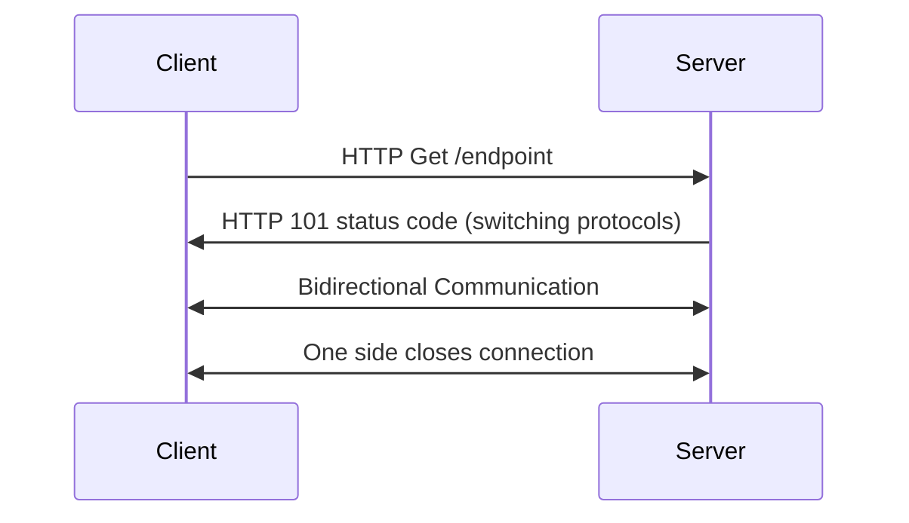
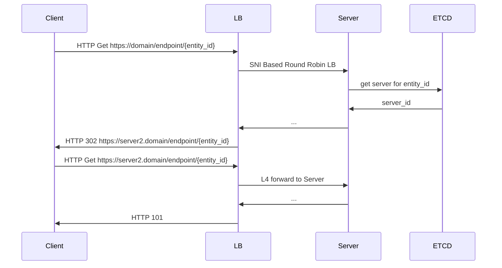

# Websockets

## What is it ?

[From Wiki](https://en.wikipedia.org/wiki/WebSocket)

The WebSocket protocol enables full-duplex interaction between a web browser (or other client application) and a web server with lower overhead than half-duplex alternatives such as HTTP polling, facilitating real-time data transfer from and to the server. This is made possible by providing a standardized way for the server to send content to the client without being first requested by the client, and allowing messages to be passed back and forth while keeping the connection open

## When to use websockets
1. Need bidirectional communication

## How does it work

Regular HTTP >= 1.1 request can be upgraded to websocket by setting
appropriate headers. 

1. 1 TCP connection == 1 websocket connection
2. Binary framing, provides stream of messages as opposed to stream of bytes in TCP.

## How to scale

### Load Balancing
As the underlying TCP connection is terminated on one server and remains 
persistent, websocket connections are hard to load balance. 

We need to think about the data flow and locality. 

Things to think about,
* Do the clients need to talk to each other ?

    * No

    Connection can end up on any server. Use simple round robin load balancing at L4. 

    * Yes  
    Can we group the peers and is the connection exclusive for the group ?
        * No, Example chat service which uses the same connection for all the operations.
        
            * Depending on the durability requirements use Redis or Kafka

        * Yes, one websocket connection per document in a collaborative document editing.

            * Place all the connections on the same server
            * Have limits on the number of peers per entity to bound the problem

#### Placing connections on the same server

