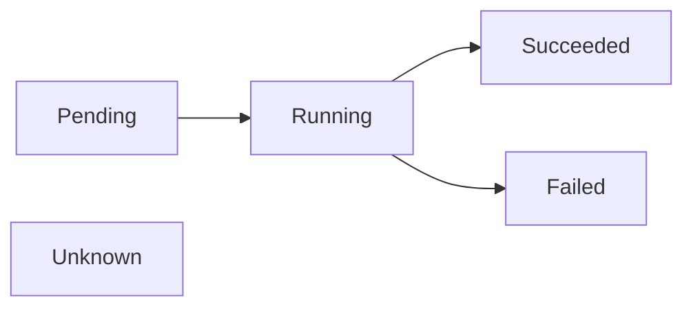

# Pod Lifecycle

# What is a Pod ?
* Pods are the smallest deployable units of computing that you can create and manage in Kubernetes.
* Pod is a group of one or mode containers, with shared storage, networking. 
* All the containers in a pod are co-located and co-scheduled and run in the same
    context.
* Pod models an application specific logical host. 
* In non containerized environments, a Pod models various processes running on 
    the same logical host.
* Pod is an environment where processes run.

# What is a shared context ?
* Set of Linux namespace, cgroups and potentially other facets of isolation
* Within a Pod's context, the individual containers might have further sub
    isolations.

# How are Pods created ?
* Pods are rarely created directly. Once of the workload resources like Deployment,
    Job, StatefulSet are used to create them. 
* Each pod is meant to run a single instance of an application, If we want to 
    scale the application horizontally, we should create multiple Pods. This is 
    referred as *replication* in Kubernetes. 
* Replicated pods are usually created 

# How are resources shared in a Pod ?
* shared volumes
* shared network, same ip address, can use localhost
* IPC, SystemV sempahores, POSIX shared memory

# Static Pods
* Pods which are managed directly by kubelet on a specific node are called
    static Pods.
* Most Pods are managed by control plane 
* These pods are bound to one kubelet on a specific node
* Main use case is to run a self hosted control plane
* The kubelet creates a mirror pod on the kube API for each static Pod, allowing
    visibility into the static pods for cluster operators. However, these pods
    cannot be controlled through the kube API. 
* These pods are created from static manifest on the filesystem

# Containers in a Pod
* Pods support running multiple containers.
* Multiple containers are co-located and co-scheduled. 
* Multiple containers share resources, dependencies and can communicate with
    each other.
* Multiple containers can coordinate when and how they are terminated.
* There are multiple kind of containers which run in a pods, init containers, 
    app containers (or main containers) and sidecar containers.
* Sidecar containers (v1.33) are init containers which have `restartPolicy: Always`. This
    lets the init containers run during the entire lifetime of the Pod.

## Health of Containers in a Pod (Probes)
* probes are diagnostics preformed periodically by the kubelet on a container
* Supported actions are Exec, TCP and HTTP

# How is security handled for a Pod ?

TDB

# Pod Lifecycle

* Pods are considered ephemeral (rather than durable)
* When Pods are created they are assigned a unique ID and scheduled to run on
    a node where it remains until termination (according to restart policy) or
    deletion. 
* Pods are only scheduled once in their lifetime; assigning a Pod to a specific 
    node is called *binding* and the process of selecting which node to use is 
    called *scheduling*.
* If a Node dies, the Pods running on (or Scheduled to run on) that node are
    marked for deletion.
* The control plan marks the Pods for removal after a timeout period. 

* Running: at least one of its primary container starts OK
* Failed: any container in Pod terminated in Failure
* Succeeded: no container in Pod terminated in Failure
* Unknown: If the Pods state cannot be obtained. Typically due to communication
    issues with the node where the Pod is running.

## How is a Pod started ?
1. API server receives pod object
    * Pod object is validated and persisted in etcd.
    * Pod status.phase is `Pending`.
2. Scheduler decides where it runs
    * the kube-scheduler continuously watches the API server for Pods without
        an assigned `nodeName`
    * It applies scheduling logic (filters + scores) -- checks resource requests,
        node selectors, taints/tolerations, affinity/anti-affinity etc.
    * Picks the best node
    * Updates the Pod's `spec.nodeName`
    * The Pod is still in `Pending`
3. kubelet on the Node sees the assignment
    * Each kubelet watches the API server for Pods scheduled to its node.
    * The kubelet sees the new Pod assigned to it and fetches the Pods object
        from the API server.
    * The kubelet creates Pod Sandbox
        * Creates storage volumes by taking to CSI 
        * Sets up namespaces (network, PID, IPC), cgroups by talking to CRI (TODO: expand)
        * creates network interface via CNI
        * Pulls container images if not already present on the node
        * Create and start containers in the defined order
            1. `initContainers` firs (in the order they are defined)
            2. app containers (in parallel if there are multiple)
4. Container runtime starts the containers
    * The kubelet talks to CRI (container runtime interface) implementation
    * The runtime for each container:
        1. creates the container filesystem (image layers + writable layer)
        2. mounts volumes
        3. sets up networking
        4. applies resource limits via cgroups
        5. starts the container processes
    * The Pod `status.phase` changes to `Running` once all the containers have
        been created and at least on container is still running or is in the process
        of stating or restarting.

### Containers in a Pod

## What happens while the Pod is running ?

## How is a Pod stopped ?

## Pod errors

## Pod disruptions
Pods do not disappear until someone (a person or a controller) destroys them,
or there is an unavoidable hardware or system software error.

