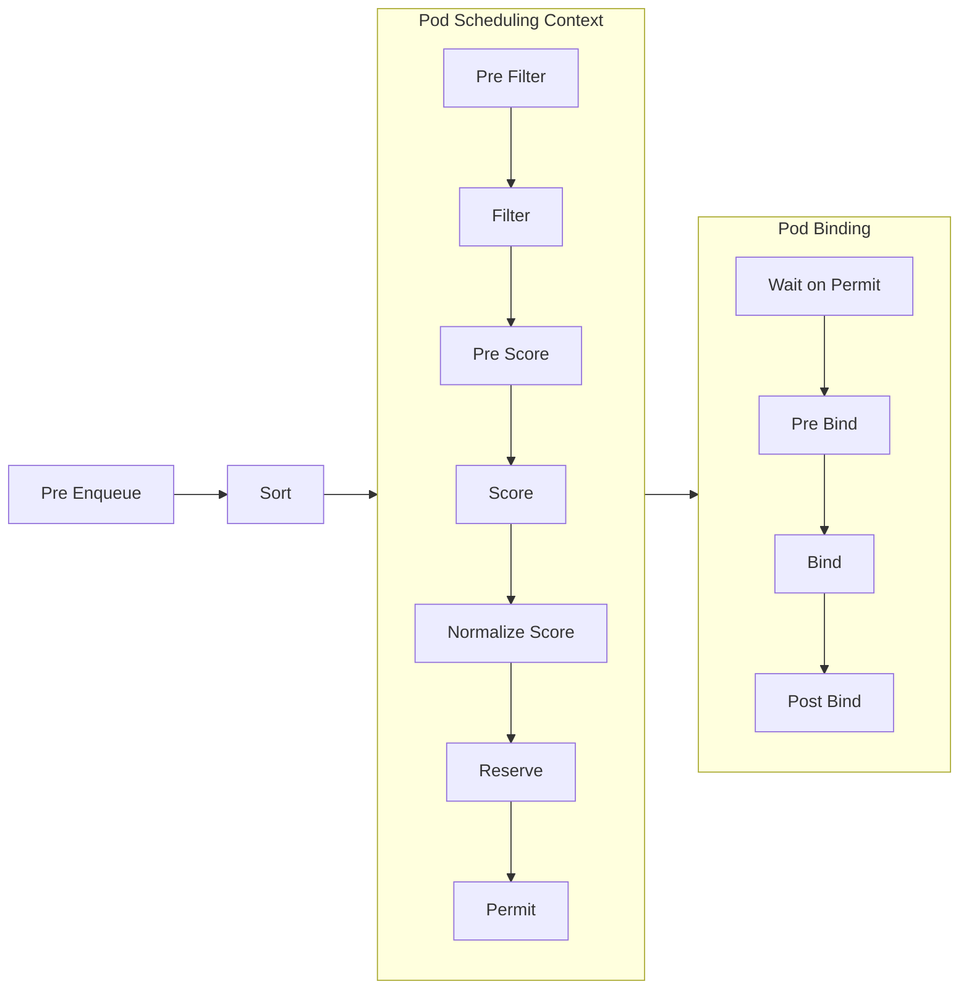

# Scheduling

## Glossary
* **Scheduling**: process of matching Pods to Nodes, so that kubelet can run them
* **Preemption**: process of terminating Pods with lower Priority so that Pods with
    hight Priority can schedule on Nodes.
* **Eviction**: process of terminating one or mode Pods on Nodes
* **Pod Disruption**: process by which Pods on Nodes are terminated either
    voluntarily or involuntarily. Voluntary disruptions are started intentionally
    by application or cluster administrators. Involuntary disruptions are 
    unintentional and can be triggered by unavoidable issues like Nodes
    running out of resources or by accidental deletions.


A scheduler watches for newly created Pods that have no Node assigned. For
every Pod that the scheduler discovers, the scheduler becomes responsible
for finding the best Node for that Pod to run on. The scheduler reaches this
placement decision taking into account the the constraints on Pods and Nodes.


## Kubernetes Scheduler

* Default scheduler, run as a part of the control plane

### Node Selection
kube-scheduler selects a Node for the Pod in the following steps,
1. Filtering
    * finds the set of Nodes where its feasible to schedule the Pod
    * example, `PodFitsResources` filter checks whether a candidate Node has
        enough available resources to meet a Pod's specific resource
        requests
    * output is a node list containing all the suitable nodes
    * if the list is empty, the Pod isn't (yet) schedulable

2. Scoring
    * ranks the remaining nodes to choose the most suitable Pod placement.
    * assigns a score to each Node after the filtering, basing this score on
        the active scoring rules

3. Assignment
    * assigns the Pod to the Node with highest rank. If there is more than
        one node with equal score, kube-scheduler selects one of these at
        random

#### How is this configured ?

**Scheduling Policies** allow to configure *Predicates* for filtering and
    *Priorities* for scoring.

**Scheduling Profiles** allow to configure Plugins that implement different
    scheduling stages, including `QueueSort`, `Filter`, `Score`, `Bind`,
    `Reserve`, `Permit` and others. 

### Assigning Pods to Nodes

* pods can be constrained so that they are restricted to run on particular
    nodes or prefer to run on particular nodes.
* this step is optional, which is required in some circumstances to control
    which node the pods deploys to.

Pods can specify node selection using the following methods,
1. `nodeSelector` field matching against node labels
2. Affinity and anti affinity
3. `nodeName` field
4. Pod topology spread constraints

#### Node Labels
* adding labels to node allows Pods to be scheduled on specific nodes or
    groups of nodes.
* if labels are used for node isolation, labels which cannot be modified by 
    kubelet should be used. 
    * `NodeRestriction` admission plugin prevents the kubelt from setting or
        modifying labels with a `node-restriction.kubernetes.io/` prefix
* simplest form of node selection constraint. 
* k8s only schedules the Pod onto nodes that have all the labels that are specified

#### Affinity and anti Affinity
* conceptually similar to `nodeSelector`, allowing to constrain which nodes
    pods can be scheduled on based on node labels
* affinity/anti-affinity rules give more control over selection logic. rules
    can be soft or preferred, so that scheduler still schedules the Pod even if it can't find a matching node.
* constraining a pod using labels on other Pods sunning on the node
    (or other topological domain), instead of just node labels, 
    which allows you to define rules for which Pods can be co-located on a node.

Affinity feature consists of two types of affinity:
* *Node affinity* functions like the `nodeSelector` field but is more expressive
    and allows to specify soft rules
* `inter pod affinity/anti-affinity` allow to constrain Pods against labels
    on other Pods.

##### Node affinity

* `requiredDuringSchedulingIgnoredDuringExecution`: scheduler can't scheduler the
    Pod unless the rule is met. This is like `nodeSelector`, with more
    expressive syntax
* `preferredDuringSchedulingIgnoreDuringExecution`: scheduler tries to fine a node
    that meets the rule. If a matching node is not available, the scheduler still
    schedules the Pod.

>   IgnoredDuringExecution means that if the node labels change after the Pods is
>   scheduled, the pod continues to run


* specified using `.spec.affinity.nodeAffinity`


> addedAffinity
> when multiple scheduling profiles are configured, we can associate a profile
> with node affinity (useful if a profile only applies to a specific set of nodes) 
>```
> apiVersion: kubescheduler.config.k8s.io/v1
> kind: KubeSchedulerConfiguration
> 
> profiles:
>  - schedulerName: default-scheduler
>  - schedulerName: foo-scheduler
>    pluginConfig:
>      - name: NodeAffinity
>        args:
>          addedAffinity:
>            requiredDuringSchedulingIgnoredDuringExecution:
>              nodeSelectorTerms:
>              - matchExpressions:
>                - key: scheduler-profile
>                  operator: In
>                  values:
>                  - foo
>``` 
> the `addedAffnity` is applied to all Pods that se `.spec.schedulerName` to 
> `foo-scheduler`, in addition to the NodeAffinity specified in PodSpec. In order
> to match the Pod, nodes need to satisfy `addedAffinity` and the Pods's
> `.spec.NodeAffinity`.

#### Inter-pod affinity and anti-affinity


## Framework
* pluggable architecture for the kubernetes scheduler.
* consists of set of *plugin* APIs that are compiled directly in the scheduler
* allows most scheduling features to be implemented as plugins while keeping
    the scheduling *core* lightweight and maintainable
* defines extension points
* plugins register to be invoked at one or more extension points
* Pod scheduling is split into two phases, **scheduling** and **binding**, together
    they are called scheduling context
    - **Scheduling** cycle selects a node for the Pod
        - run serially
    - **Binding** cycle applies the decision to the cluster
        - run concurrently

### Interfaces

