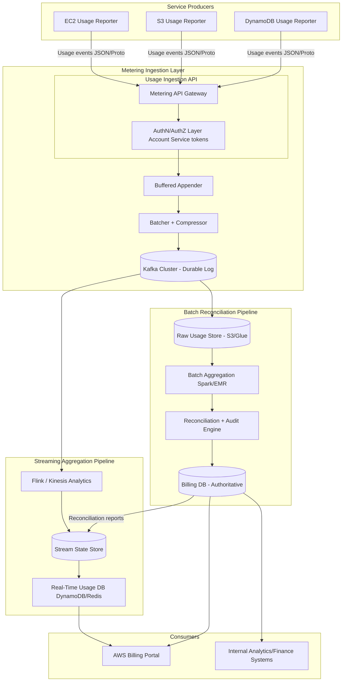
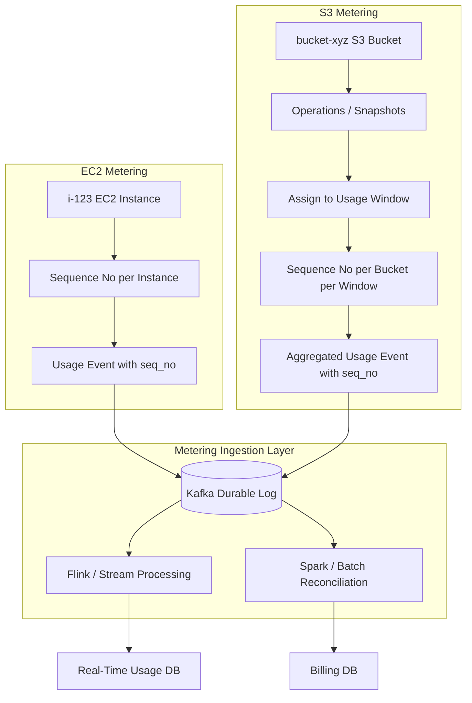

# Prompt
System Design AWS is in the very early phase, where new cloud services such as EC2, DynamoDB, and S3 are under development.
Before the launch of these cloud services, we need to build the billing infrastructure,
so AWS can charge customers for their use of different services. 

Task is to design this billing infrastructure. 

* Different AWS cloud services should be able to send usage data to the billing service at any granularity. 
* Billing service/infrastructure needs to generate bills for different accounts. 
* Account users should be able to view their service usage through AWS portal.

---

---
